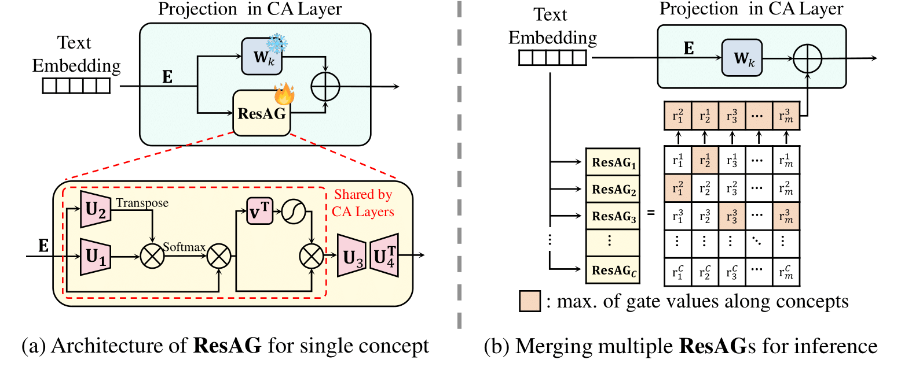

# Concept Pinpoint Eraser for Text-to-image Diffusion Models via Residual Attention Gate

### ✏️ [Project Page](https://hyun1a.github.io/cpe.io) | 📄 [Paper]

> **Concept Pinpoint Eraser for Text-to-image Diffusion Models via Residual Attention Gate** 
> Byung Hyun Lee1, Sungjin Lim1, Seunggyu Lee, Dong Un Kang, Se Young Chun  
> 
>**Abstract**:  
Remarkable progress in text-to-image diffusion models has brought a major concern about potentially generating images on inappropriate or trademarked concepts. Concept erasing has been investigated with the goals of deleting target concepts in diffusion models while preserving other concepts with minimal distortion. To achieve these goals, recent concept erasing methods usually fine-tune the cross-attention layers of diffusion models. In this work, we first show that merely updating the cross-attention layers in diffusion models, which is mathematically equivalent to adding \emph{linear} modules to weights, may not be able to preserve diverse remaining concepts. Then, we propose a novel framework, dubbed Concept Pinpoint Eraser (CPE), by adding \emph{nonlinear} Residual Attention Gates (ResAGs) that selectively erase (or cut) target concepts while safeguarding remaining concepts from broad distributions by employing an attention anchoring loss to prevent the forgetting. Moreover, we adversarially train CPE with ResAG and learnable text embeddings in an iterative manner to maximize erasing performance and enhance robustness against adversarial attacks. Extensive experiments on the erasure of celebrities, artistic styles, and explicit contents demonstrated that the proposed CPE outperforms prior arts by keeping diverse remaining concepts while deleting the target concepts with robustness against attack prompts.

## Setup for experiments

**OS**: Ubuntu 18.04.5 LTS

**Python**: 3.9.19
<pre>
conda create -n CPE python=3.9
pip install torch torchvision --index-url https://download.pytorch.org/whl/cu118
pip install xformers
</pre>

Please install packages in requirements.txt
<pre>
pip install -r requirements.txt
</pre>

## Running Experiments
### Celebrities Erasure
**Train:**
<pre>
sh ./shell_scripts/celebs/train_celeb_cpe_single.sh
</pre>

**Generation:**
<pre>
sh ./shell_scripts/celebs/generate_by_celeb_model.sh
</pre>

1. For generation of diverse domains such as artistic styles or characters from celebrity-erased model, please change the variable GEN_CONFIG in
   ./shell_scripts/celebs/generate_by_celeb_model.sh (config files for different domains are listed)
2. We have already provided pre-trained ResAGs for 50 celebrities in ./output, so you can execute the generation without training

### Artistic Styles Erasure
**Train:**
<pre>
sh ./shell_scripts/artists/train_artist_cpe_single.sh
</pre>

**Generation:**
<pre>
sh ./shell_scripts/artists/generate_by_artist_model.sh
</pre>

1. For generation of diverse domains such as celebrites or characters from celebrity-erased model, 
   please change the variable GEN_CONFIG in ./shell_scripts/artists/generate_by_artist_model.sh (config files for different domains are listed)
2. We have already provided pre-trained ResAGs for 100 artistic styles in ./output, so you can execute the generation without training

## Explicit Contents Erasure
**Train:**
<pre>
sh ./shell_scripts/explicit/train_explicit_cpe_single.sh
</pre>

**Generation (Explicit contents):**
<pre>
sh ./shell_scripts/explicit/generate_by_explicit_model_explicit.sh
</pre>

**Generation (COCO-30K):**
<pre>
sh ./shell_scripts/explicit/generate_by_explicit_model_coco.sh
</pre>

1. We have already provided pre-trained ResAGs for four explicit concepts in ./output, so you can execute the generation without training
